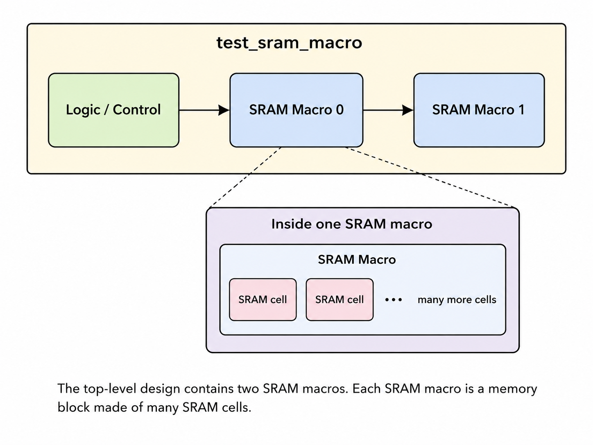

<h1 align="center"></h1>
<p align="center">
    <a href="https://opensource.org/licenses/Apache-2.0"></a>
    <a href="https://www.python.org"></a>
    <a href="https://github.com/psf/black"></a>
    <a href="https://mypy-lang.org/"></a>
    <a href="https://nixos.org/"></a>
</p>
<p align="center">
    <a href="https://colab.research.google.com/github/librelane/librelane/blob/main/notebook.ipynb"></a>
    <a href="https://librelane.readthedocs.io/"></a>
    <a href="https://fossi-chat.org"></a>
</p>

[LibreLane](https://librelane.org) is a powerful and versatile infrastructure
library that enables the construction of digital implementation flows for
application specific integrated circuits (ASICs) based on open-source and
commercial electronic design automation (EDA) tools.

## Introduction

Hello! I am currently conducting research at NC A&T as a member of the ADEPT
Laboratory. This GitHub repository is forked from the [LibreLane GitHub Repository](https://github.com/librelane/librelane)
and is meant to provide a general overview of how LibreLane fits into
my research this summer.

## What to Expect

This tutorial will detail running the LibreLane flow on RTL (Register Transfer Level)
designs. It will be split into two parts:

* Running the LibreLane flow on an SRAM macro [openlane2-ci-designs test_sram_macro](https://github.com/efabless/openlane2-ci-designs/tree/main/test_sram_macro)
* An interactive tutorial using a verilog RTL design from EDAplayground [edaplayground](https://www.edaplayground.com/playgrounds?searchString=&_showAllResults=on&language=&simulator=&methodologies=&_libraries=on&_easierUVM=on&curated=true&_curated=on)

## Installation/Getting Started

You'll need the following:

* Python **3.10** or higher with PIP, Venv and Tkinter

### Nix (Recommended)

Works for macOS and Linux (x86-64 and aarch64). Recommended, as it is more
integrated with your filesystem and overall has less upload and download deltas.

See
[Nix-based installation](https://librelane.readthedocs.io/en/latest/installation/nix_installation/index.html)
in the docs for more info.

### Cloning Repository and Invoking Nix Shell

At this point you should have the NIX shell downloaded on your local machine. Open
a Linux/Ubuntu terminal and clone this repository:

```bash
git clone https://github.com/bdawgcodes28/Su26LLEX.git
```

Once you have successfully cloned the repository, invoke the nix shell.

```bash
nix-shell ~/Su26LLEX/shell.nix
```

After all packages are downloaded, the terminal prompt should change to:

```bash
[nix-shell:~Su26LLEX]
```

## Running Default LibreLane Flow

We are going to use an SRAM macro design. SRAM cells are designed to hold single bits
of information (0 or 1) until the value is overwritten or power is removed. This specific
design integrates two SRAM cells and other support circuitry to make up the macro. A block diagram
of the SRAM macro and the SRAM cells it integrates can be found below.




