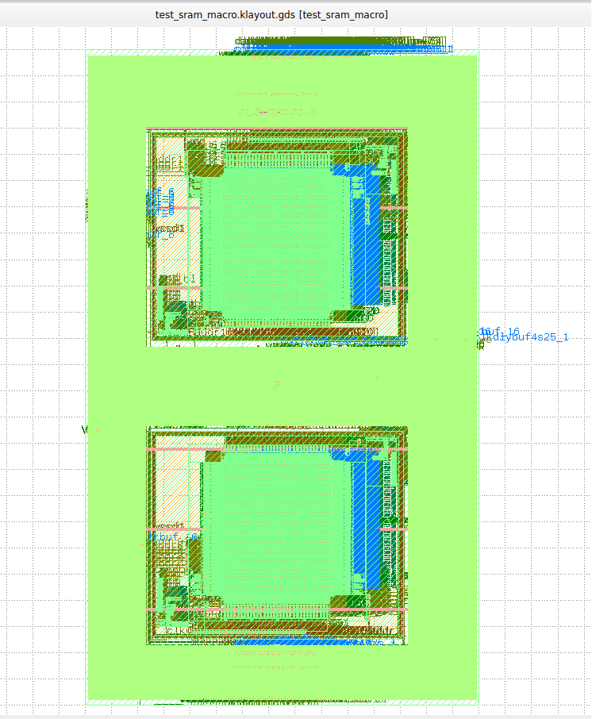
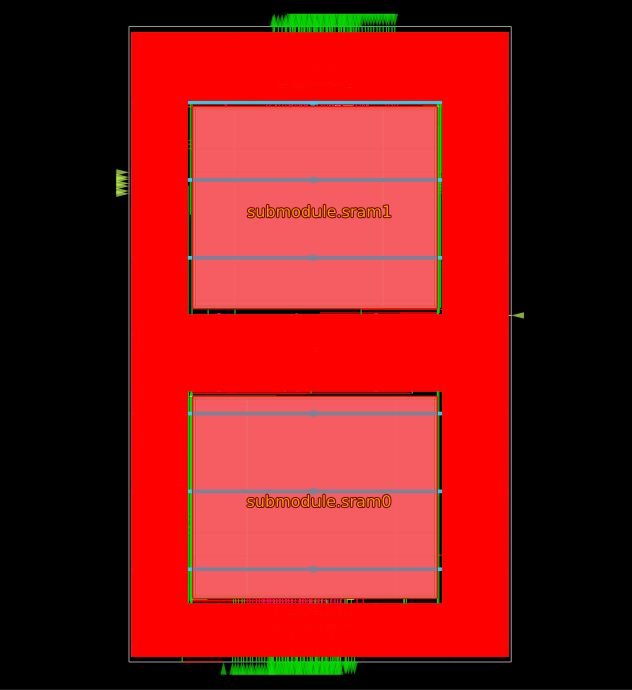

## Introduction

Hello! I am currently conducting research at NC A&T as a member of the ADEPT
Laboratory. This GitHub repository is forked from the [LibreLane GitHub Repository](https://github.com/librelane/librelane)
and is meant to provide a general overview of how LibreLane fits into
my research this summer.

## What to Expect

This tutorial will detail running the LibreLane flow on RTL (Register Transfer Level)
designs. It will be split into two parts:

* Running the LibreLane flow on an SRAM macro [openlane2-ci-designs test_sram_macro](https://github.com/efabless/openlane2-ci-designs/tree/main/test_sram_macro)
* An interactive tutorial using a verilog RTL design from EDAplayground [edaplayground](https://www.edaplayground.com/playgrounds?searchString=&_showAllResults=on&language=&simulator=&methodologies=&_libraries=on&_easierUVM=on&curated=true&_curated=on)

## Installation/Getting Started

You'll need the following:

* Python **3.10** or higher with PIP, Venv and Tkinter

### Nix (Recommended)

Works for macOS and Linux (x86-64 and aarch64). Recommended, as it is more
integrated with your filesystem and overall has less upload and download deltas.

See
[Nix-based installation](https://librelane.readthedocs.io/en/latest/installation/nix_installation/index.html)
in the docs for more info.

### Cloning Repository and Invoking Nix Shell

At this point you should have the NIX shell downloaded on your local machine. Open
a Linux/Ubuntu terminal and clone this repository:

```bash
git clone https://github.com/bdawgcodes28/Su26LLEX.git
```

Once you have successfully cloned the repository, invoke the nix shell.

```bash
nix-shell ~/Su26LLEX/shell.nix
```

After all packages are downloaded, the terminal prompt should change to:

```bash
[nix-shell:~Su26LLEX]
```

## Running Default LibreLane Flow

We are going to use an SRAM macro design. SRAM cells are designed to hold single bits
of information (0 or 1) until the value is overwritten or power is removed. This specific
design integrates two SRAM cells and other support circuitry to make up the macro. View block diagram below:


### Exploring the Files

First we will navigate to the example we wish to run through the LibreLane flow. To get there,
run the following from the project root:

```bash
cd librelane/examples/test_sram_macro
ls
```

This command will take you to the example and list out all the files. You will also see a runs
folder that can can ignore for the time being. I will give a brief explanation of the files here:

* config.json: this is a configuration file that contains values used to control the flow
* macro_placement.cfg: this is a file used in the configuration that maps where each macro (in this case SRAM cell) should be placed in the top level
* sky130_sram_1kbyte_1rw1r_32x256_8.bb.v: this verilog files contains the design of the SRAM cell

You will notice that there is a directory named 'src.' The src directory contains the source code/design
that we will be using.

### RTL

The sourse RTL of the design consists of one file. That file being (`test_sram_macro.v`).
It is located in the src folder. You can navigate to the src folder from the project root
using the following commannd:

```bash
cd librelane/examples/test_sram_macro/src
ls
```

This file represents the top level of our design. To inspect its contents, run the following command:

```bash
nano test_sram_macro.v
```

Inside the file you will see two instances of the SRAM cell being integrated in the top level; sram0 and sram1.
After the flow is complete, you will see these cells in the hardened design.

### Running LibreLane Flow

navigate back to:

```bash
cd librelane/examples/test_sram_macro
```

Double check that you are still inside a (nix-shell). Your terminal prompt should look like this:

```bash
[nix-shell:~Su26LLEX/librelane/examples/test_sram_macro]
```

To invoke the flow, run the following command:

```bash
librelane config.json --run-tag YOUR-RUN-NAME
```

Change YOUR-RUN-NAME to the name of your run (e.g. test1)

## Checking Results

### Viewing the Layout

Navigate to the following point in the project directory from the root:

```bash
cd librelane/examples/test_sram_macro/runs
ls
```

You should see a directory with the same name as your run tag from before. (cd) into that directory
and list out all the files using (ls). From here, navigate to the 'final' directory.

```bash
cd final
ls
```

### KLayout

To view the hardened design in KLayout, run the following:

```bash
cd klayout_gds
klayout test_sram_macro.klayout.gds
```

These commands load the .gds file into KLayout and you should see the following:


If you do not have klayout installed on your machine follow the necessary steps and re-run commands.

### OpenROAD GUI

To view the hardened design in the OpenROAD GUI navigate back to the final directory and run the following:

```bash
cd odb
openroad
read_db test_sram_macro.odb
gui::show
```

These commands load the .odb into the OpenROAD gui and you should see the following:


If you do not have [OpenROAD](https://github.com/The-OpenROAD-Project/OpenROAD) installed on your machine follow the neceesary steps and re-run commands

